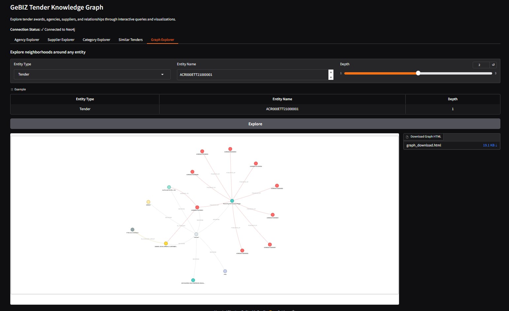

# GeBIZ Tender Knowledge Graph

A tender intelligence system that transforms GeBIZ tender/award text into a queryable Neo4j knowledge graph using schema-driven extraction (GLiNER2) and a traceable Chunk → Entity import pattern.

## Overview

This system ingests GeBIZ award records from data.gov.sg, converts each record into a compact "tender card" chunk, extracts entities and relations using a schema-first [GLiNER2](https://arxiv.org/abs/2507.18546) pipeline, and imports the results into Neo4j with end-to-end traceability.  
It includes a demo query pack (agency, supplier, category, requirements overlap) plus a "similar tenders" ranking for exploration.

### Core Value Proposition

- **Schema-first extraction**: Repeatable entity/relationship parsing that is explainable and extensible
- **Traceability**: Every extracted entity is linked to the exact source chunk text
- **Actionable queries**: Practical graph queries and similarity search, not just entity extraction

### Target Use Cases

* **Procurement analysts** exploring agency spend and supplier coverage




## Technology Stack

- **Python 3.10+**: Core language
- **[Neo4j Aura](https://neo4j.com/product/auradb/)**: Graph database backend
- **GLiNER2**: Schema-driven entity and relation extraction
- **Gradio**: Web UI framework
- **PyVis + NetworkX**: Graph visualization
- **pytest**: Testing framework

## Architecture

### Pipeline Overview

The system follows a five-stage pipeline:

```
1. Fetch GeBIZ data → normalize fields
2. Build chunk JSONL
3. Extract entities/relations with GLiNER2
4. Import nodes and edges into Neo4j
5. Run query pack and similarity search
```

### Entity + Relationship Model

The knowledge graph uses the following schema:

**Node Types:**
- `(:Chunk {id, text, source, tender_no, award_date, awarded_amt, ...})` - Source data traceability
- `(:__Entity__ {name})` with dynamic labels:
  - `:Tender` - Tender entities
  - `:Agency` - Government agencies
  - `:Supplier` - Awarded suppliers
  - `:Category` - Tender categories
  - `:Requirement` - Tender requirements
  - `:Keyword` - Extracted keywords
  - `:Date` - Important dates

**Relationship Types:**
- `(:Tender)-[:PUBLISHED_BY]->(:Agency)` - Which agency published the tender
- `(:Tender)-[:AWARDED_TO]->(:Supplier)` - Which supplier won the award
- `(:Tender)-[:IN_CATEGORY]->(:Category)` - Category classification
- `(:Tender)-[:HAS_REQUIREMENT]->(:Requirement)` - Tender requirements
- `(:Tender)-[:HAS_KEYWORD]->(:Keyword)` - Extracted keywords
- `(:Tender)-[:HAS_DEADLINE]->(:Date)` - Deadline information
- `(:Chunk)-[:MENTIONS]->(:__Entity__)` - Traceability edge linking entities to source chunks

### Directory Structure

```
gebiz-tenders/
├── data/
│   ├── raw/                # Cached fetches from data.gov.sg
│   ├── chunks/             # Chunk JSONL files
│   └── extracted/          # Entities/relations JSONL files
├── pipeline/
│   ├── fetch.py            # Data fetching and normalization
│   ├── chunk.py            # Chunk building
│   ├── extract.py          # GLiNER2 entity/relation extraction
│   ├── normalize.py        # Text normalization
│   ├── import_graph.py     # Neo4j import
│   ├── schema.py           # Extraction schema definitions
│   └── run_all.py          # Pipeline orchestrator
├── queries/
│   ├── agency.py           # Agency explorer queries
│   ├── supplier.py         # Supplier explorer queries
│   ├── category.py         # Category explorer queries
│   ├── similar.py          # Similarity search queries
│   └── requirements.py     # Requirements overlap queries
├── ui/
│   └── app.py              # Gradio web interface
```

## Setup Instructions

### Prerequisites

- Python 3.10+
- Neo4j Aura account (cloud) or Neo4j database

### 1. Neo4j Aura Setup

1. Sign up for [Neo4j Aura](https://neo4j.com/cloud/aura/)
2. Create a free database instance
3. Copy the connection details:
   - URI (e.g., `neo4j+s://xxxxx.databases.neo4j.io`)
   - Username (typically `neo4j`)
   - Password

### 2. Install Dependencies

You can use either `uv` (recommended, faster) or standard `pip`:

**Using uv**

```bash
# Install uv if not already installed
curl -LsSf https://astral.sh/uv/install.sh | sh

# Create virtual environment and install dependencies
uv venv
source .venv/bin/activate  # On Windows: .venv\Scripts\activate
uv pip install -r requirements.txt
```

### 3. Configure Environment

```bash
# Copy the example environment file
cp .env.example .env

# Edit .env with your credentials
nano .env  # or use your preferred editor
```

Update `.env` with your Neo4j Aura credentials:

```
NEO4J_URI=neo4j+s://<your-db-id>.databases.neo4j.io
NEO4J_USERNAME=neo4j
NEO4J_PASSWORD=<your-password>
NEO4J_DATABASE=neo4j
```

Optional: Configure GLiNER2 model settings (defaults work well):

```
GLINER_MODEL_NAME=fastino/gliner2-large-v1
GLINER_DEVICE=cpu
GLINER_BATCH_SIZE=8
GLINER_THRESHOLD=0.3
```

### 4. Verify Setup

```bash
# Test Neo4j connection
python -c "from pipeline.config import Config; c = Config.load(require_neo4j=True); print('Connected!')"
```

## Running the Pipeline

### Quick Start (Small Dataset)

### Processing records from Dataset

```bash
# Process 2000 records (as specified in PRD)
make run-all LIMIT=2000
```
This will:
1. Fetch 2000 tender records from data.gov.sg
2. Build chunks from the records
3. Extract entities and relations using GLiNER2
4. Import the graph into Neo4j
5. Display summary statistics

### Step-by-Step Execution

You can also run individual pipeline steps:

```bash
# Step 1: Fetch data
make fetch LIMIT=2000

# Step 2: Build chunks
make chunk LIMIT=2000

# Step 3: Extract entities (auto-normalizes)
make extract

# Step 4: Import to Neo4j
make import LIMIT=2000

# View extraction samples
make view-samples COUNT=5
```

## Gradio Web Interface

The system includes an interactive web interface built with Gradio for exploring the knowledge graph.

### Launch the UI

```bash
make ui
```

Or directly:

```bash
python -m ui.app
```

The interface will launch at `http://localhost:7860` (or the URL shown in terminal).

### UI Features

The Gradio interface provides 6 tabs for exploration:

1. **Agency Explorer**
   - Search for tenders by agency
   - View results as a sortable table
   - Example: Enter "Ministry of Health" to see all health-related tenders

2. **Supplier Explorer**
   - Search for tenders awarded to a specific supplier
   - View total awarded amounts per supplier
   - Example: Enter "Acme Corp" to see their awarded tenders

3. **Category Explorer**
   - Browse all tender categories
   - View keywords and requirements per category
   - Example: Select a category to see associated terms

4. **Similar Tenders**
   - Find tenders similar to a reference tender
   - Interactive graph visualization showing tender connections
   - Nodes are color-coded by entity type
   - Drag nodes, hover for tooltips, zoom/pan the graph

5. **Graph Explorer**
   - Ad-hoc subgraph visualization
   - Explore neighborhoods around any entity
   - Select entity type (Agency, Supplier, Keyword, etc.)
   - Enter entity name and depth for neighborhood exploration


## Query Examples

### Using the Makefile

```bash
# Top 5 agencies by tender count
make query-agencies MODE=top LIMIT=5

# Tenders awarded to a specific agency
make query-agencies AGENCY='Accounting And Corporate Regulatory Authority'

# Top 5 suppliers by awarded amount
make query-suppliers MODE=top LIMIT=5

# Tenders awarded to a specific supplier
make query-suppliers SUPPLIER='KPMG SERVICES PTE. LTD.'

# All categories
make query-categories MODE=all

# Tenders in a specific category
make query-categories CATEGORY='IT Services & Software'

# Tenders with shared requirements (min 2 shared)
make query-requirements MIN_OVERLAP=2 LIMIT=10

# Similar tenders
make query-similar TENDER='ACR000ETT20300002' LIMIT=5
```

### Using Python API

```python
from queries.agency import get_top_agencies, get_tenders_by_agency
from queries.supplier import get_top_suppliers, get_tenders_by_supplier
from queries.category import explore_categories
from queries.similar import find_similar_tenders
from queries.requirements import find_requirements_overlap

# Agency queries
top_agencies = get_top_agencies(limit=10)
agency_tenders = get_tenders_by_agency("Accounting And Corporate Regulatory Authority")

# Supplier queries
top_suppliers = get_top_suppliers(limit=10)
supplier_tenders = get_tenders_by_supplier("KPMG SERVICES PTE. LTD.")

# Category exploration
categories = explore_categories()

# Similarity search
similar_tenders = find_similar_tenders("ACR000ETT20300002", limit=5)
```

### Neo4j Browser Queries

You can also run queries directly in [Neo4j Browser](https://neo4j.com/cloud/aura/neo4j-browser/):

```cypher
// Show all tenders for an agency
MATCH (t:Tender)-[:PUBLISHED_BY]->(a:Agency {name: 'Accounting And Corporate Regulatory Authority'})
RETURN t.tender_no, t.award_date, t.awarded_amt
LIMIT 10;

// Top suppliers by awarded amount
MATCH (t:Tender)-[:AWARDED_TO]->(s:Supplier)
RETURN s.name, sum(toFloat(t.awarded_amt)) as total
ORDER BY total DESC
LIMIT 10;

// Find similar tenders (sharing keywords)
MATCH (t1:Tender {name: 'Tender XYZ'})-[:HAS_KEYWORD]->(k:Keyword)<-[:HAS_KEYWORD]-(t2:Tender)
RETURN t2.name, collect(k.name) as shared_keywords
ORDER BY size(shared_keywords) DESC
LIMIT 5;
```

## Troubleshooting

### Common Issues

**Issue**: `ModuleNotFoundError: No module named 'gliner2'`
```bash
# Install GLiNER2
pip install gliner2>=0.1.0
```

**Issue**: `ServiceUnavailable: Unable to connect to Neo4j Aura`
- Check your NEO4J_URI in .env
- Verify your Neo4j Aura database is running
- Ensure your credentials are correct
- Check network connectivity

**Issue**: `GLiNER2 model download is slow`
- First run downloads the model (~1GB)
- Subsequent runs use cached model
- Model is cached in `~/.cache/huggingface/`

**Issue**: `Memory error during extraction`
- Reduce GLINER_BATCH_SIZE in .env (default: 8)
- Process fewer records at a time with LIMIT flag
- Close other applications to free memory


## References

- Data source: `https://data.gov.sg/datasets?query=gebiz&resultId=d_acde1106003906a75c3fa052592f2fcb`


## License